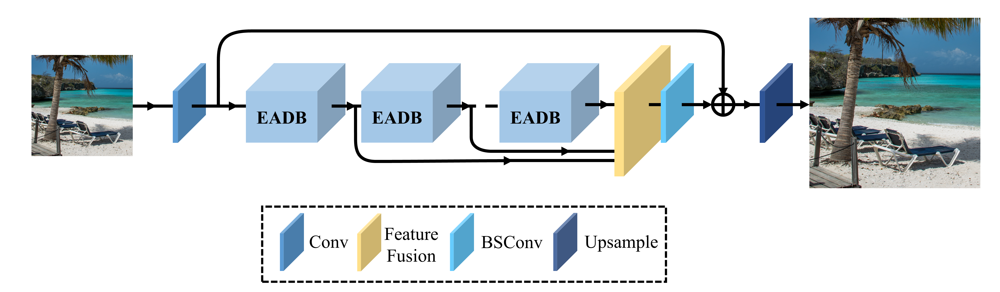
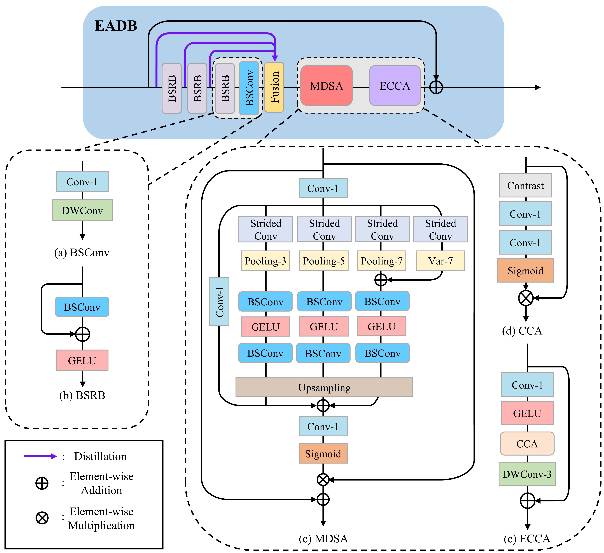

# **MDRN**

Multi-level Dispersion Residual Network for Efficient Image Super-Resolution [[paper](https://openaccess.thecvf.com/content/CVPR2023W/NTIRE/papers/Mao_Multi-Level_Dispersion_Residual_Network_for_Efficient_Image_Super-Resolution_CVPRW_2023_paper.pdf)]

Yanyu Mao[^*], Nihao Zhang[^*], Qian Wang[^†], Bendu Bai, Wanying Bai, Haonan Fang, Peng Liu, Mingyue Li, Shengbo Yan

[^*]: indicates contribute equally
[^†]: Corresponding author






## 💻Environment

- [PyTorch >= 1.9](https://pytorch.org/)
- [Python 3.7](https://www.python.org/downloads/)
- [Numpy](https://numpy.org/)
- [BasicSR >= 1.3.4.9](https://github.com/XPixelGroup/BasicSR)

## 🔧Installation

```
pip install -r requirements.txt -i http://pypi.douban.com/simple/ --trusted-host pypi.douban.com
```

## 📜Data Preparation

The trainset uses the DIV2K (800) + LSDIR(the first 10k). In order to effectively improve the training speed, images are cropped to 480 * 480 images by running script extract_subimages.py, and the dataloader will further randomly crop the images to the GT_size required for training. GT_size defaults to 128/192/256 (×2/×3/×4). 

```
python extract_subimages.py
```

The input and output paths of cropped pictures can be modify in this script. Default location: ./datasets/DL2K.

## 🚀Train

▶️ You can change the training strategy by modifying the configuration file. The default configuration files are included in ./options/train/MDRN. Take one GPU as the example.

```
### Train ###
### MDRN ###
python train.py -opt ./options/train/MDRN/train_mdrn_x2.yml --auto_resume  # ×2
python train.py -opt ./options/train/MDRN/train_mdrn_x3.yml --auto_resume  # ×3
python train.py -opt ./options/train/MDRN/train_mdrn_x4.yml --auto_resume  # ×4
```

For more training commands, please check the docs in [BasicSR](https://github.com/XPixelGroup/BasicSR)

## :toilet:Test

▶️ You can modify the configuration file about the test, which is located in ./options/test/MDRN. At the same time, you can change the benchmark datasets and modify the path of the pre-train model. 

▶️ We provide all MDRN and MDRN-S (for NTIRE2023 ESR) pre-trained models, located in the folder ./pretrain_models.

▶️ All benchmark datasets can be obtained from the official website.  You should update the paths in the configuration files based on the paths where benchmark datasets are located on your computer.

```
### Test ###
### MDRN ###
python basicsr/test.py -opt ./options/test/MDRN/test_mdrn_x2.yml  # ×2
python basicsr/test.py -opt ./options/test/MDRN/test_mdrn_x3.yml  # ×3
python basicsr/test.py -opt ./options/test/MDRN/test_mdrn_x4.yml  # ×4
```

## 🚩Results

The inference results on benchmark datasets are available at [Google Drive](https://drive.google.com/file/d/1ZrAJgGJ3catBCOPX_eTCmjvqUYzoNhIz/view?usp=sharing) or [Baidu Netdisk](https://pan.baidu.com/s/1Q87ERhvTD-GMpAE03o_Aag) (access code: TeLX).

## :mailbox:Contact

If you have any questions, please feel free to contact us, [zwyczhang@stu.xupt.edu.cn](mailto:zwyczhang@stu.xupt.edu.cn) and [bolttt@stu.xupt.edu.cn](mailto:bolttt@stu.xupt.edu.cn).
